# TreeHub

Browser extension that adds an IDE-like code tree, pull request review tools, repository bookmarks and a pull request review queue, with notes you can search, to GitHub.

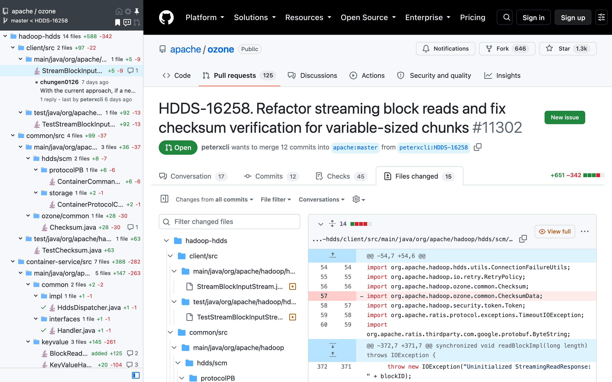

## Features

### Code tree

Browse repositories as a tree with file-type icons. Huge repositories are lazy-loaded.

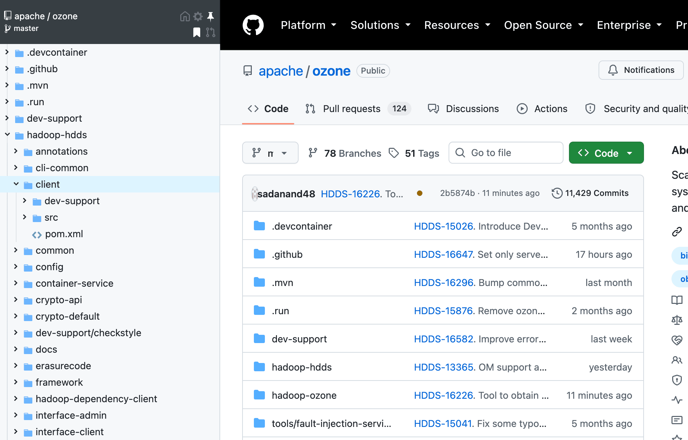

### Pull request changes

Only the files a pull request (or commit) changes, with additions and deletions per file and folder, the files you marked as viewed, and the review conversations with their author, replies and resolved/outdated state. Click a file or a conversation to jump to it.

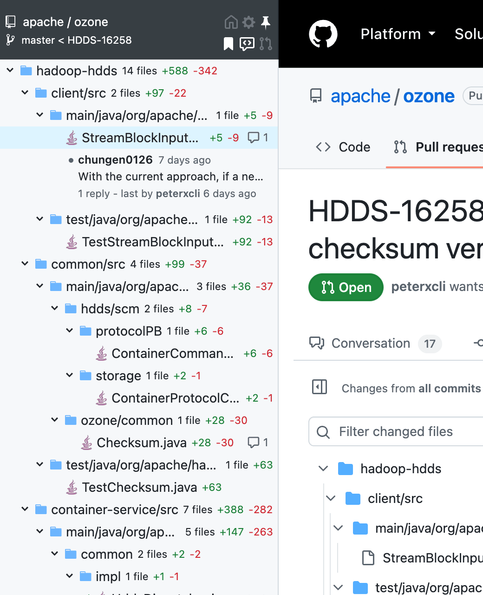

### View full file

A "View full" button on each pull request diff shows the entire file with its changes, syntax highlighting and conversations. Click line numbers to select lines (Shift+click or drag for a range), then comment on them or copy their permalink.

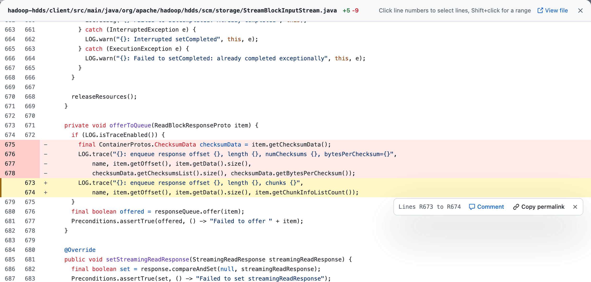

The comment box works like GitHub's: a Markdown toolbar and shortcuts, suggested changes, and a Preview tab rendered by GitHub, where permalinks to lines of the repository show as code snippets (also in conversations). GitHub only accepts line comments on lines of the diff, within one hunk for several lines, so comments on other lines are posted as file comments linking to them.

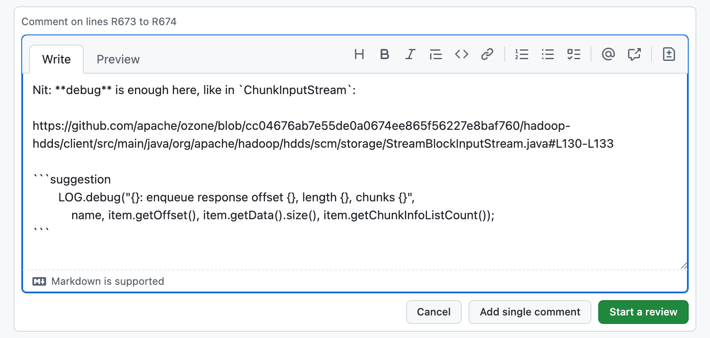

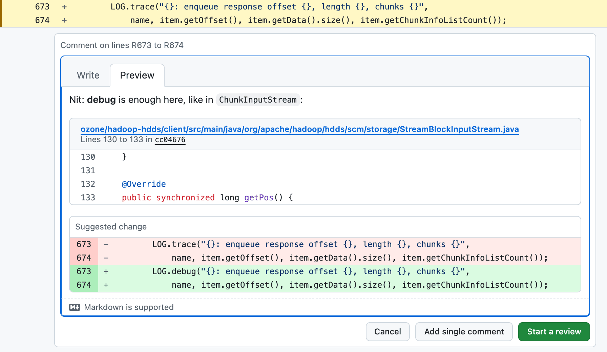

### Pull request navigation

The open pull requests of the repository, with review filters (awaiting your review, reviewed by you, no reviews, changes requested, review required, approved).

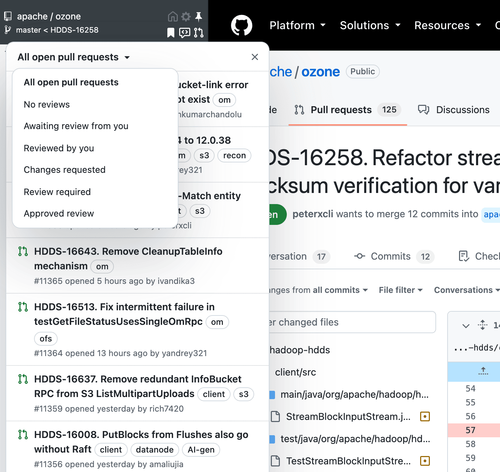

### Sidebar

Pin, resize and dock it on the left or right; double-click its edge to fit it to the tree. At any width, nothing is cut: names wrap where they read well (after the / of merged folders, between the words of names), the stats of a change go below the name when they don't fit next to it, and levels indent less in a narrow sidebar. Follows GitHub's light and dark themes.

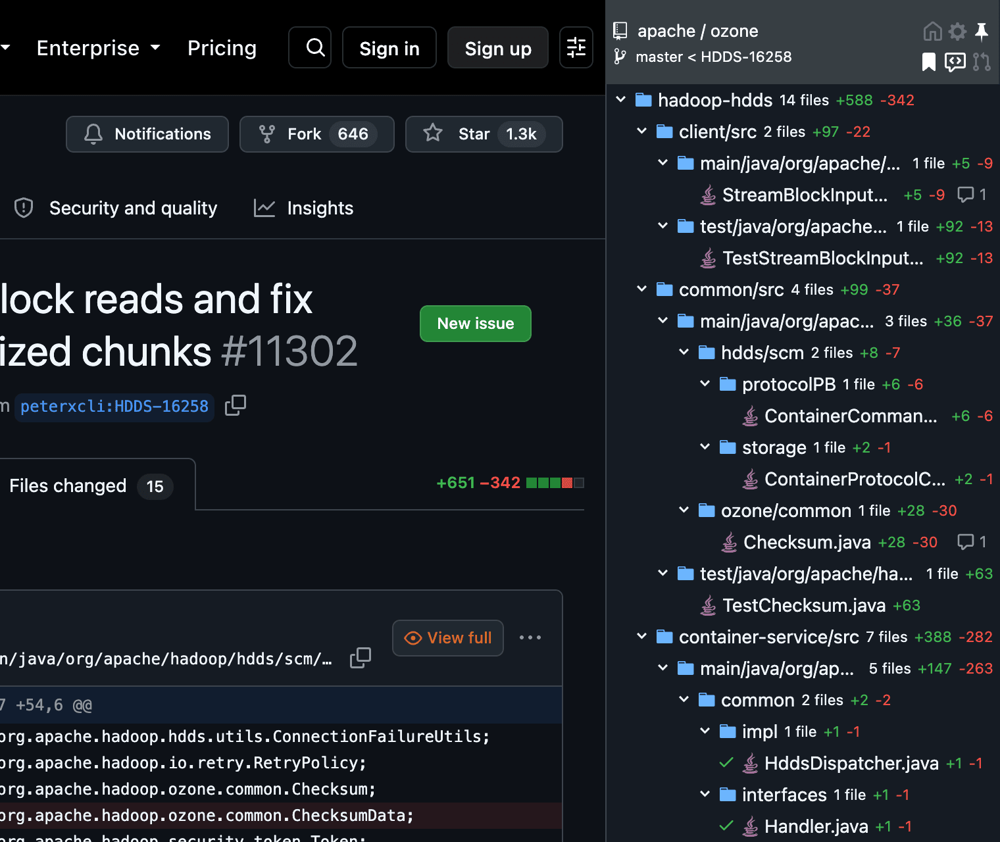

### Bookmarks

Click the bookmark icon in the sidebar to bookmark the current repository. It turns bold once bookmarked; click it again to remove the bookmark. The dashboard lists them, and can add them too.

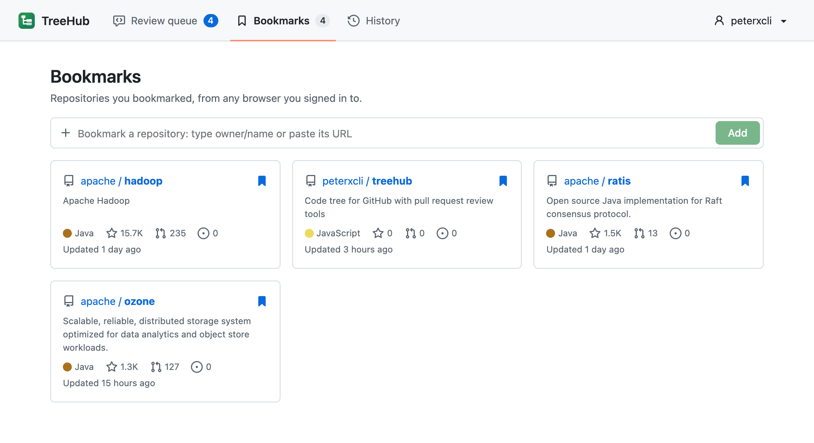

### Review queue

On a pull request, click the review icon in the sidebar to follow it (bold when queued). TreeHub then tracks, for you, independent statuses of each queued pull request: review requested, new commits since your review, replies to your review comments (and who replied), when you were last mentioned, updates since you last looked, approved, approved by you, your other reviews, changes requested, checks, merge conflicts, draft, ready for review, merged and closed. Queued pull requests are refreshed every 15 minutes, and the toolbar icon counts those that need your attention.

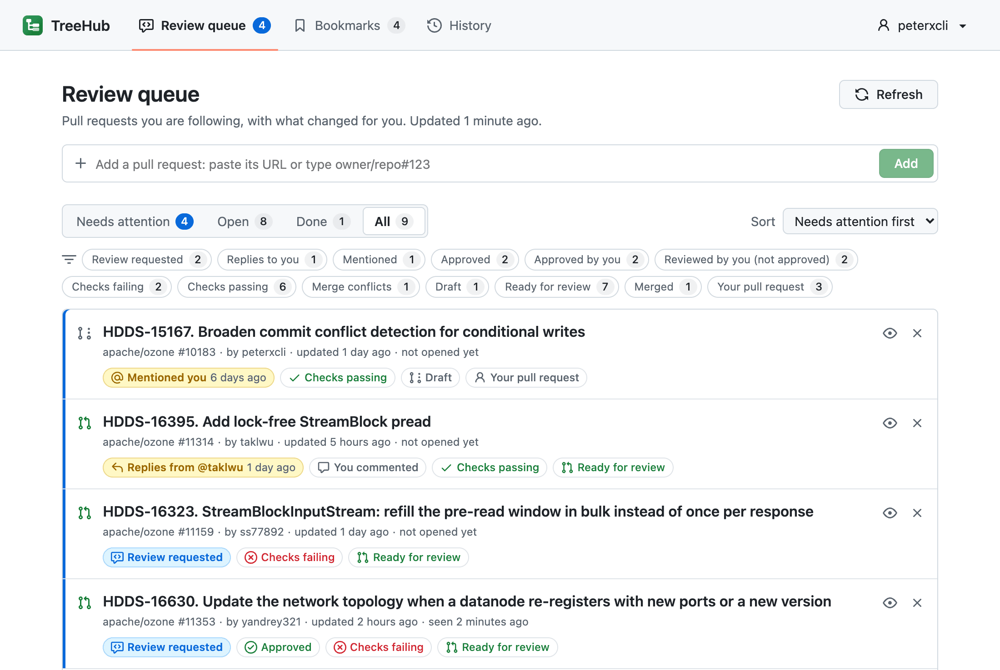

### Notes and search

When you bookmark a repository or queue a pull request, the sidebar offers to add a note: why you follow it, what to check (<kbd>⌘</kbd>+<kbd>Enter</kbd> saves it, <kbd>Esc</kbd> skips). The dashboard's add forms take a note too, and the note button of each bookmark or queued pull request adds, edits or removes it later.

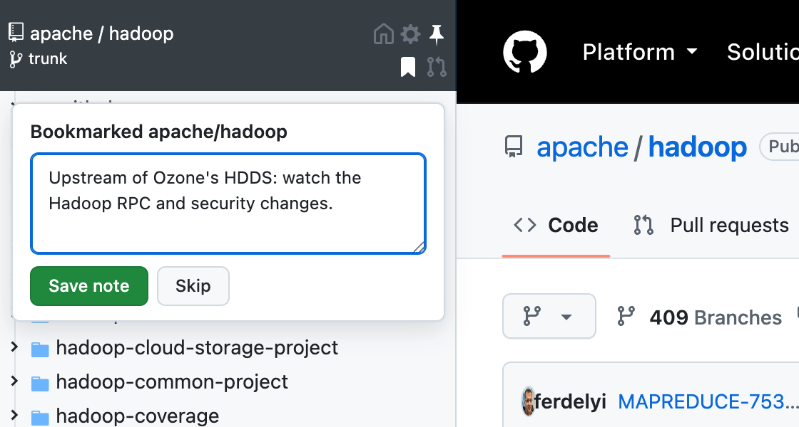

The Search tab of the dashboard (or <kbd>/</kbd>) searches your notes, the titles of your queued pull requests and the names of the repositories. Results come best first (ranked with BM25, a note counting more than a title, and a title more than a repository name) with the matching words highlighted. Words are found in other forms too ("review" finds "reviewing"), the last one while you type it, and Chinese, Japanese and Korean text as well.

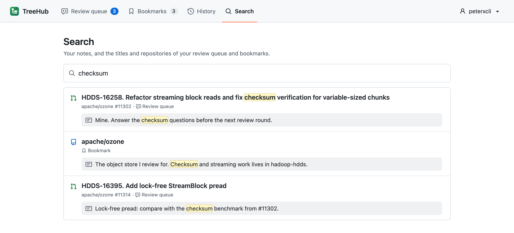

### Credential problems explained

When GitHub refuses TreeHub's token (expired or revoked, missing scope, no access to the repository, organization single sign-on or app restrictions, rate limit), a popup says why, with the token, its scopes and when GitHub last accepted it, and how to fix it. An expired TreeHub sign-in shows its expiry date.

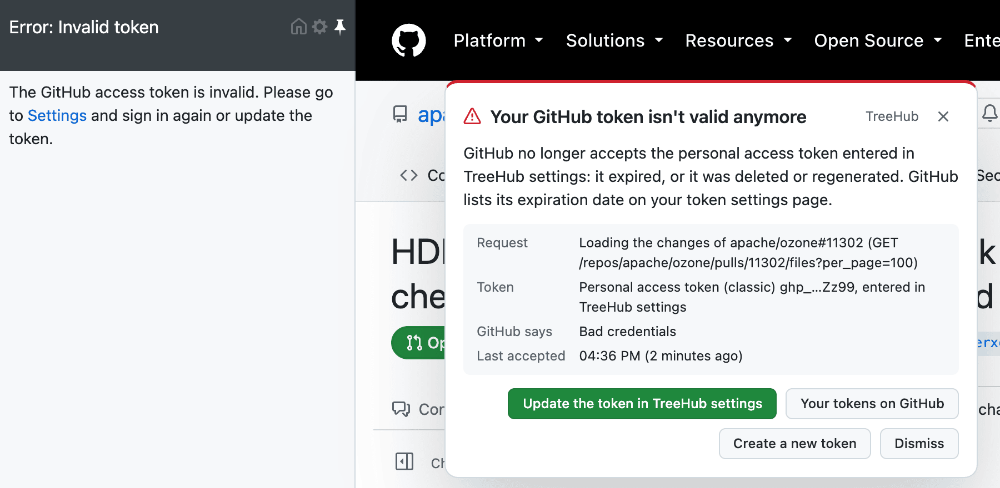

### History

While you are signed in, TreeHub remembers the repositories and pull requests you open, most recent first. Each entry is kept 30 days after your last visit by default (1 to 365 days); pause the recording, remove entries or clear the history in the dashboard.

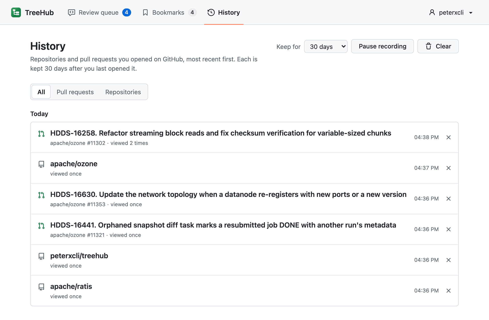

### Dashboard

The extension's own page (toolbar icon, or the home icon in the sidebar) lists your review queue, with filters by status, your bookmarks and your history, and searches your notes. If you get signed out without asking (e.g. the sign-in expired), the sidebar says so and the toolbar icon shows an orange "!".

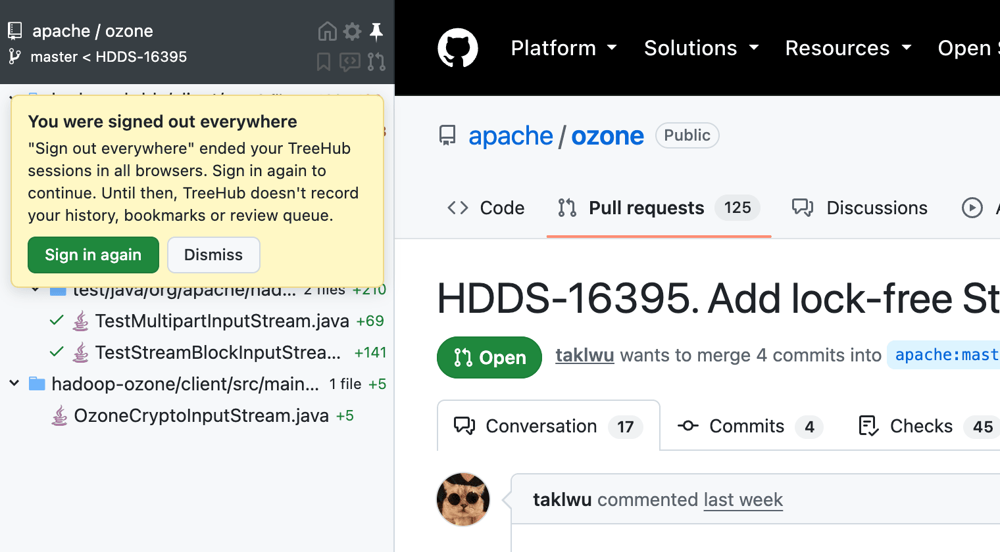

Bookmarks, the review queue and the history need you to sign in with GitHub (dashboard, or the sidebar settings). A sign-in lasts 30 days and is renewed while you use TreeHub, once half of it has passed. They are kept by the TreeHub server ([`server/`](server)), so they follow you across browsers.

## Access token

TreeHub uses the GitHub API. Without a token it works on public repositories, within GitHub's limit of 60 API requests per hour. Signing in with GitHub gives TreeHub a token (with the `repo` scope). You can instead enter a [personal access token](https://github.com/settings/tokens/new?scopes=repo&description=TreeHub%20browser%20extension) in TreeHub's settings (gear icon); it is used in place of the one from signing in. A token lets TreeHub:

- browse private repositories and raise the API limit,
- see viewed and resolved states everywhere, and use the "…you" pull request filters,
- add review comments from the "View full" dialog.

Use a classic token with the `repo` scope (or `public_repo` for public repositories only), or a fine-grained token with read access to contents and metadata, and read and write access to pull requests. The token is stored only in your browser and sent only to GitHub.

## Hotkeys

Pin or unpin the sidebar with <kbd>⌘</kbd>+<kbd>⇧</kbd>+<kbd>s</kbd> (macOS) or <kbd>Ctrl</kbd>+<kbd>⇧</kbd>+<kbd>s</kbd>. Change them in the settings; separate several hotkeys with a comma. Supported modifiers: `⇧`, `shift`, `option`, `⌥`, `alt`, `ctrl`, `control`, `command` and `⌘`. Supported special keys: `backspace`, `tab`, `clear`, `enter`, `return`, `esc`, `escape`, `space`, `up`, `down`, `left`, `right`, `home`, `end`, `pageup`, `pagedown`, `del`, `delete` and `f1` through `f19`.

## Privacy

Without signing in, TreeHub talks only to GitHub and collects nothing. When you sign in, the TreeHub server keeps your GitHub handle and profile, your bookmarks, your queued pull requests and when you last opened them, and your notes on them; your GitHub token stays in your browser (the server only passes it on when you sign in, and when it renews a token that GitHub made expire), and statuses are computed there. See the [privacy policy](PRIVACY.md).

## Development

Requires Node.js 18+.

```bash
npm install
npm run build     # builds the extension into tmp/chrome
npm start         # rebuilds on changes
npm test          # unit tests
npm run typecheck
npm run lint
```

Then load `tmp/chrome` as an unpacked extension (`chrome://extensions` → Developer mode → Load unpacked). `npm run dist` zips it into `dist/chrome.zip`, the Chrome Web Store package. TreeHub targets Chrome 116 and later, and github.com.

The code tree and review tools are a content script (`src/`, jQuery). The dashboard and the background service worker (`app/`) use Vue, TypeScript and Vite; the API types are generated from `server/proto`. The backend is a Go Cloudflare Worker with D1 ([`server/README.md`](server/README.md)). To use a local backend, run it with `DEV_AUTH=true` and build the extension against it:

```bash
VITE_TREEHUB_API=http://localhost:8787 VITE_TREEHUB_DEV_LOGIN=true npm run build
```

The backend only signs in the extension IDs listed in its `ALLOWED_EXTENSION_IDS`; an unpacked build has an ID derived from its folder, shown on `chrome://extensions`.

## Releasing

Publishing a [GitHub release](https://github.com/peterxcli/treehub/releases/new) with a tag like `v1.2.3` builds TreeHub with that version, attaches the package to the release and submits it to the Chrome Web Store ([workflow](.github/workflows/publish.yml)). Pre-releases are skipped. The version must be higher than the one in the store.

The workflow needs, in the repository settings:

- secret `CWS_SERVICE_ACCOUNT`: JSON key of a Google Cloud service account, with the Chrome Web Store API enabled in its project and its email added in the Account section of the [Developer Dashboard](https://chrome.google.com/webstore/devconsole) ([guide](https://developer.chrome.com/docs/webstore/service-accounts)),
- variables `CWS_PUBLISHER_ID` and `CWS_EXTENSION_ID`.

Check the setup without publishing anything by running the workflow manually (Actions → Publish → Run workflow), or locally:

```bash
CWS_SERVICE_ACCOUNT_FILE=key.json CWS_PUBLISHER_ID=... CWS_EXTENSION_ID=... npm run publish:chrome -- --status
```

## License and credits

TreeHub is free software licensed under the [GNU Affero General Public License v3.0](LICENSE).

It is a modified version of the open-source edition of [Octotree](https://github.com/ovity/octotree) by Buu Nguyen and the Octotree team. Changes by peterxcli since 2026-09-29: pull request review features, sidebar docking, Manifest V3, a new build, and the TreeHub name and icon. TreeHub is not affiliated with or endorsed by Octotree or GitHub.

Bundled libraries: [jQuery](https://jquery.com), [jQuery UI](https://jqueryui.com), [jsTree](https://www.jstree.com), [keymaster](https://github.com/madrobby/keymaster), [file-icons](https://github.com/file-icons), [highlight.js](https://highlightjs.org), [Octicons](https://primer.style/octicons), [Vue](https://vuejs.org) and [Protobuf-ES](https://github.com/bufbuild/protobuf-es), under their own licenses.
